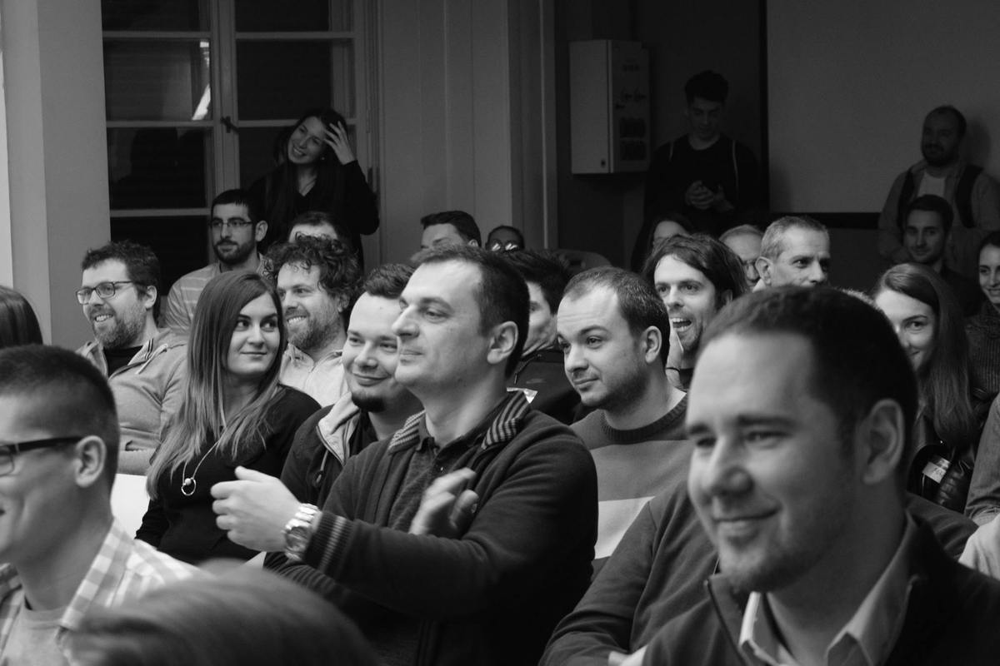
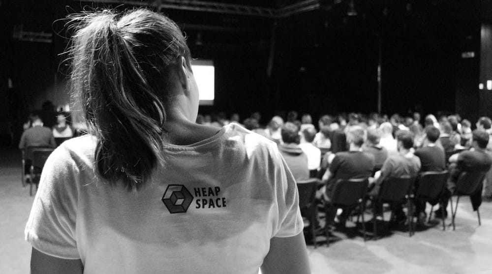
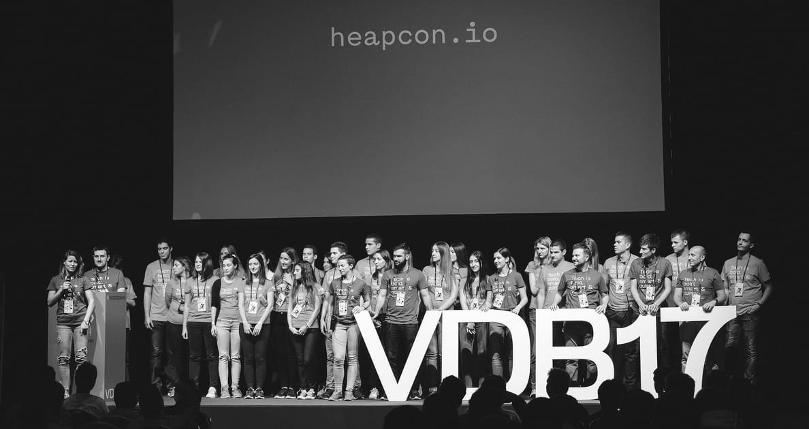

+++

+++
### Tech Breakfast

Monthly event – on each first Wednesday of the month – where we see quick showcases of entrepreneurial ideas as we cosily sip the first morning coffee. A couple of five-minute presentations, two-minute Q&A sessions, and networking, made complete by the flavour of [Domaće kiflice](http://domacekiflice.rs/), is a terrific way to start your day.

[Tech Breakfast](https://tehnoloskidorucak.io/ "Tehnološki doručak") is the place to exchange ideas, and you can apply to take part, just like with any other Heapspace project. No matter whether you’re a coder, designer, entrepreneur or a marketer, come show your idea and inspire others!

If you want to share your idea, write to us at: [dorucak@heapspace.rs](mailto:dorucak@heapspace.rs).

***

### Back to school

We want to get you back to school, but to those classes you actually liked, or the ones you never had.

What used to be Geek Night, we now call "Back to school" with changed rules. The speakers for this event are cherry picked, because all of Heapspace events need to be worthy of your time! So, we are focusing on quality.

If you want to be a "teacher", drop us a line at: [sedmicas@heapspace.rs](mailto:sedmicas@heapspace.rs)

***

### Heapcon

Regional tech conference crafted for software engineers will take place this year in October (17-19). Voxxed Days Belgrade successor, [Heapcon](http://heapcon.io/) will bring an even better speakers line up, new formats of knowledge exchange and it will present regional expertise in the domain of software development.

