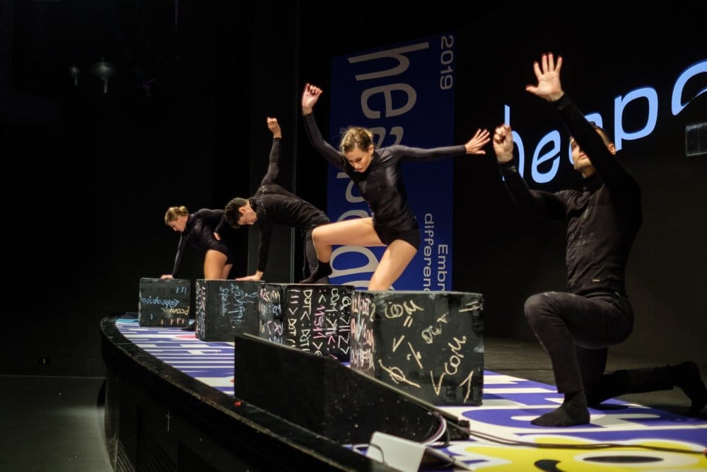
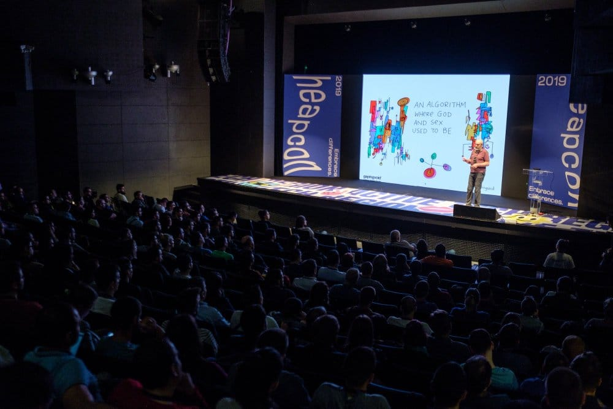
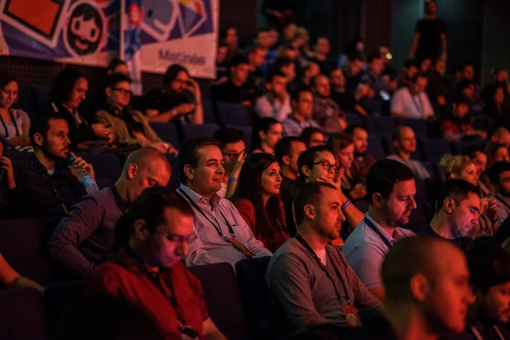
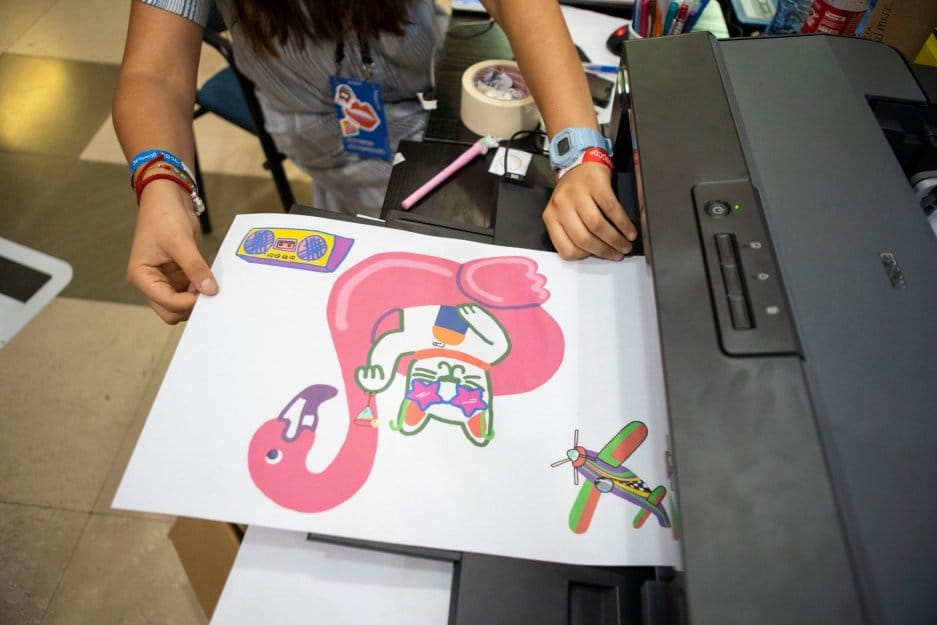
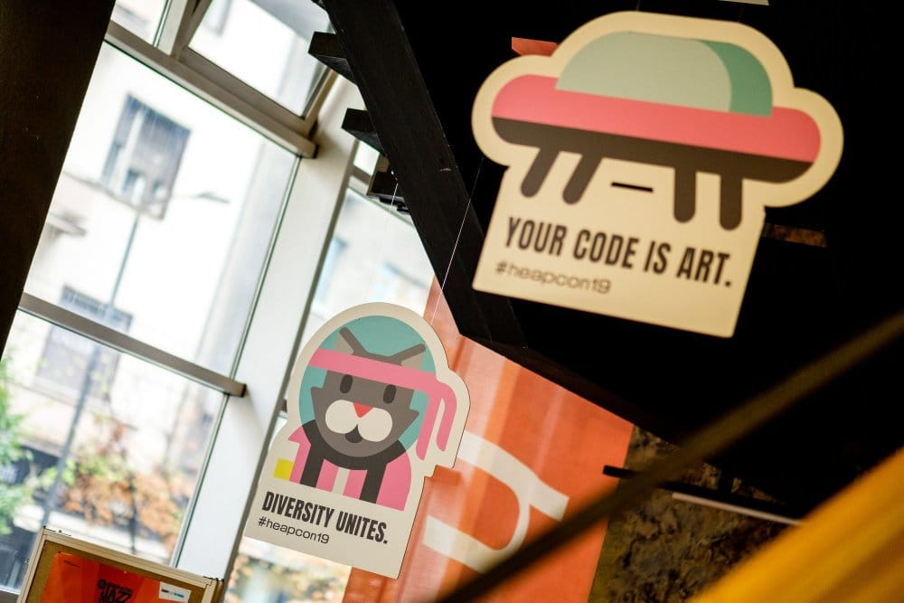

The morning hours of the first day of Heapcon 2019 were marked by clouds and rainy weather. Making way through the gloomy late-September streets of Belgrade to the Youth Center (Dom omladine) on this morning probably left a few of us feeling less-than-inspired to partake in any meaningful conversations.

But waiting at the other end of this trip through the rain was a jam-packed and vividly decorated space bursting with energy. Shortly upon arrival and armed with coffee, visitors moved to the main stage, dubbed H-Prime and branded with a quirky animated robot head, for the opening ceremony of this year’s edition of Heapcon - a regional tech conference that managed to bring together hundreds of IT enthusiasts in the city center of Belgrade.

As the crowd assembled at H-Prime, attendees were treated with an impressive dance performance from Dance Factory that played with the themes of technology and mechanics, setting the stage for two days of traversing through different tech issues.

## What is complexity and what does it have to do with cats and dogs?

Following this dance piece, philosopher and founder of Cognitive Edge Dave Snowden took visitors on a journey through the elaborate and intricate world of complexity in design thinking. His talk, titled _Designing for Complexity_, was a thought-provoking one perfectly suited to kick off a range of other topics that would be discussed during the two-day conference.

Navigating through stories from his professional life and research that points to the inherently complex design of humans, Snowden proclaimed that design thinking has become a commodity in the same way Agile has become.

Nevertheless, he shared his insights into approach this subject and broke down the building blocks of the complexity of human nature - explaining why biases make us more efficient, why as individuals we’re poor-decision makers and why do cat-people understand complexities better than dog owners. “If you have cats you understand complexities, if you have dogs you’re trying to avoid complexity,” Snowden treated us with a familiar joke.

Moving along, a series of talks hosted by local and international names in the tech industry took place at the three stages of Heapcon. Aside from the largest H-Prime stage, Ninja the Cat and Outer Space stages welcomed guests interested in AI and deep learning, Kubernetes, Java, biofeedback technology, microservices, but also the less-industry-specific topic of overcoming fears in order to become a conference speaker.

NASA’s Jet Propulsion Laboratory (JPL) took the spotlight during two sessions, in Lois Kim’s _Navigating Through Space_ which looked at visual strategy and Denis Radin’s _Applying NASA Coding Guidelines to JavaScript_ that explored applying NASA coding guidelines to JavaScript / HTML apps.

## Fun and games, and a bit of art

Peppered with ample coffee breaks in between sessions, Heapcon visitors also had the chance to interact with local tech companies at their booths, which offered table football, quizzes, code battles and presentations, as well as the chance to see what different businesses are up to and excellent networking opportunities.

One of the most eye-catching booths was an interactive art project by artist Miss Hokusai. Heapcon visitors had the chance to tap into their creative sides and create their own artwork to take home with them as souvenirs from this year’s gathering.

Finally, to conclude Day 1 of Heapcon 2019, a candlelit dinner in the Jevremovac Botanical Garden was served for the conference speakers, setting the mood for the second and final day of Heapcon.

## Embrace differences

The many facets of diversity formed [the core theme of Heapcon 2019](/blog/embrace-differences/). Embracing differences on a variety of levels was the message put forward by Heapcon’s organizers in an effort to promote equality, nurture creativity and help the regional tech community develop further.

The idea was to unite diverse perspectives and emphasize the strength of collaboration, the sharing of knowledge and finding each other on the path of creating new and exciting milestones in the industry, which brings us back to Dave Snowden’s opening keynote.

As Snowden showcased in that first talk during the morning hours of Day 1 and the pouring rain, the complexities that form us as people shouldn’t be ignored, but rather accepted, incorporated and proudly displayed in our work and our community. Whether we’re cat-lovers or dog-lovers.

