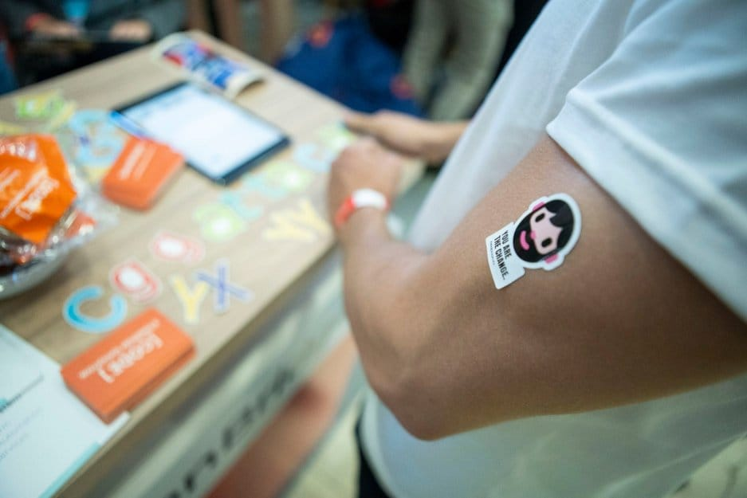
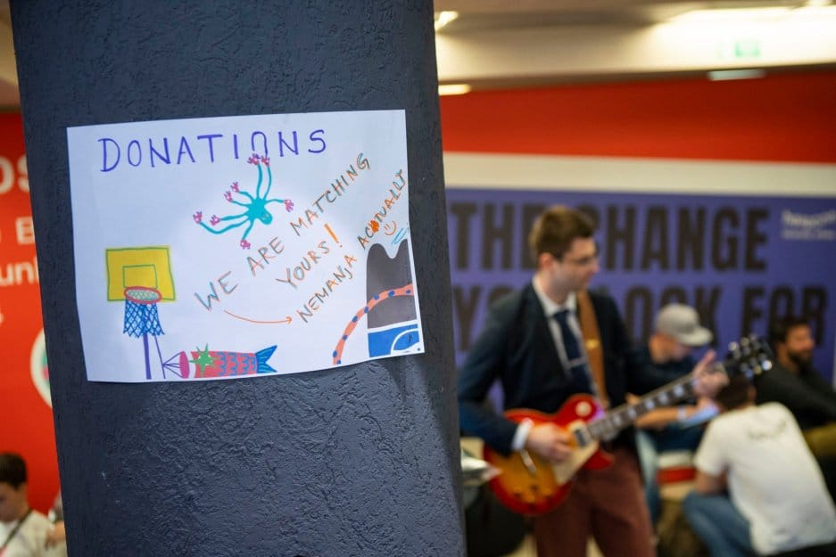
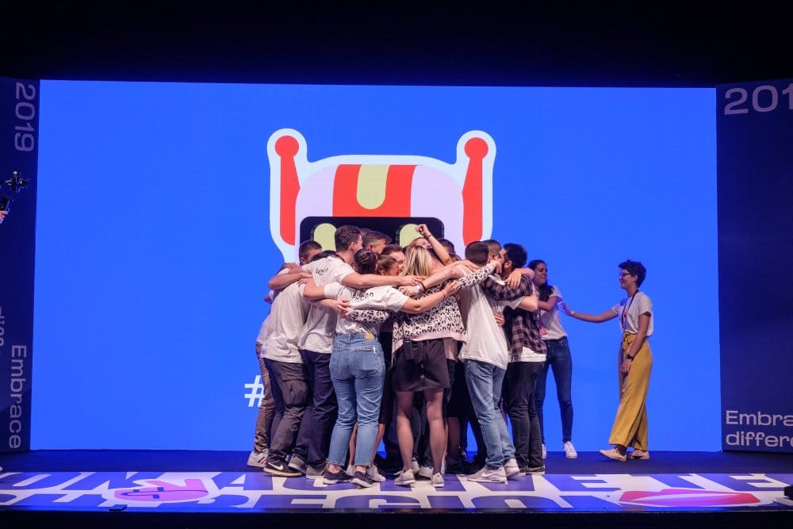
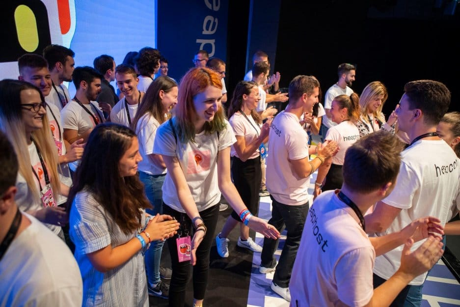

Following a busy first day of Heapcon 2019, the second day of the Belgrade tech conference followed the same pattern - intriguing ideas, dedicated speakers, meet and greets, but this time with a rock show.

Better weather conditions and the feeling of a certain familiarity helped the second day of Heapcon begin on an even more energetic note.

## Coffee with and a slice of philosophy

Computational philosopher or self-described big geek Ted Neward is no stranger to Heapcon. As a guest at previous tech conferences organized by Heapspace Neward touched on the subject of *Polytechnic Careering* in front of a Belgrade audience before.

This year, Neward kicked off Day 2 of the conference posing the question *Jack of all trades, master of none?* in a talk that quickly animated even the sleepiest of guests in the morning hours of the H-Prime stage, proving himself as a master of public speaking once again.

Through the lens of his own professional experience, Neward’s engaging session served some food for thought for everyone out there who feels trapped within the dichotomy of specializing in one programming language or aiming to be a polyglot.

## Jam sessions in between conference sessions

Nemanja Miljkovic captured the attention of a very enthusiastic crowd that packed the Outer Space stage with his demonstration of building a guitar amplifier using the Web Audio API. But his contribution to Heapcon didn't end with this talk as Nemanja entertained visitors with a guitar performance at the Heapspace booth afterward.

As Nemanja strummed to classic rock hits on his guitar, Heapcon guests were encouraged to donate to three local organizations that help children battling cancer and rare diseases. Finally, after his demonstration and jam-session, Nemanja decided to match all of the donations himself.

And as no tech conference would be complete without the magic word *start-up*, Zoja Kukic from the Digital Serbia Initiative gave a presentation on the Serbian start-up ecosystem. Reflecting on data concerning the number of start-ups in Serbia, as well as the challenges they face, Zoja compared the results to those from other European countries. Along with her co-speakers, she rounded off the talk with highlighting some of the strengths and weaknesses of the local start-up culture.

A slew of other compelling talks progressed during the day, ranging from giving old tech a new life, developing in Kotlin, reinventing the web to working with serverless architecture, edge computing, RabbitMQ and other topics of interest in the community.

**A Heapcon farewell**  Computer scientist Sumit Gulwani from Microsoft concluded Heapcon 2019 with a talk titled *Automated Program Generation from Input-Output Examples* that saw him present a new frontier in AI.

Inspired by an airplane encounter with a woman who asked Gulwani if there is a way to merge two columns in Excel “when one column has a first name, the other the last, so that a column has both first and last names?,” he embarked on a mission to explore Programming By Example (PBE) - which aims to enable non-programmers to create programs by providing examples of what they need.

The closing ceremony of this year’s Heapcon gathered conference attendees at the H-Prime stage for one last time. Awards were presented, thanks were given and the entire team applauded for another successful year of bringing people together at Heapcon.

Those that weren’t drained or had flights to catch convened at Lisabon Jazz Kantina near the Heapcon venue for the conference celebratory matinée. Dim lights, music, drinks and a friendly atmosphere - this is how Heapcon 2019 wrapped up.

