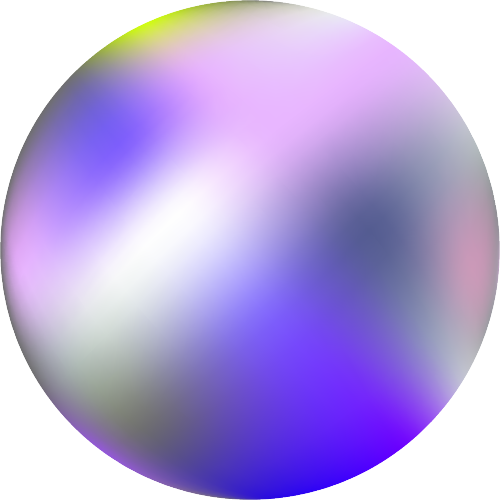
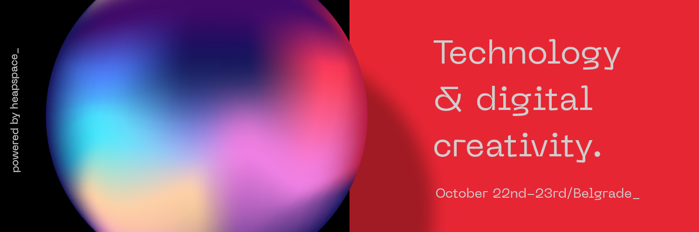
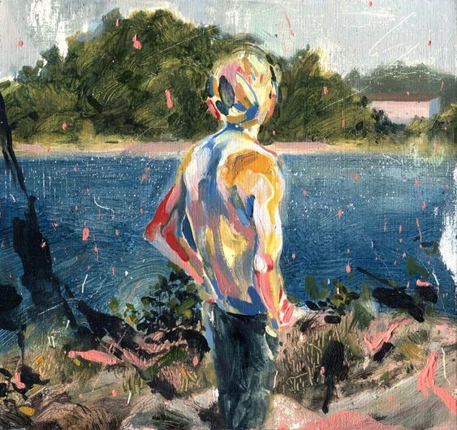
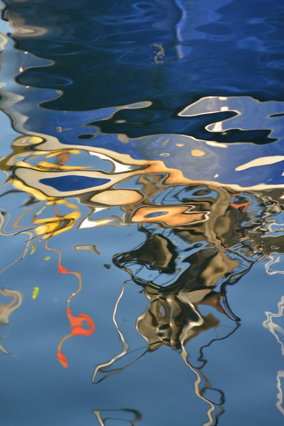
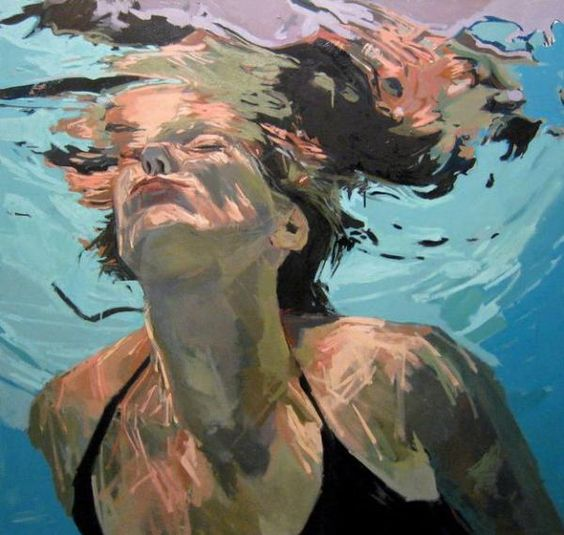
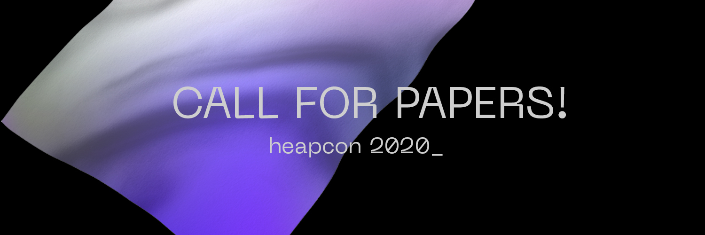
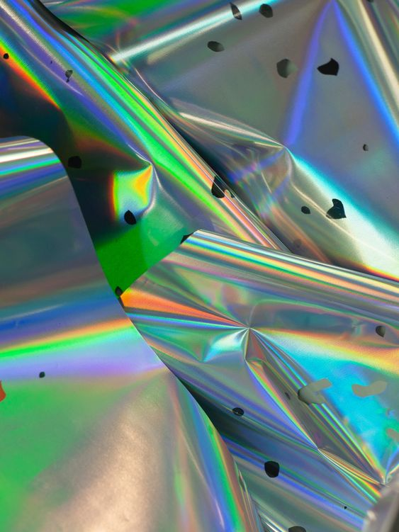
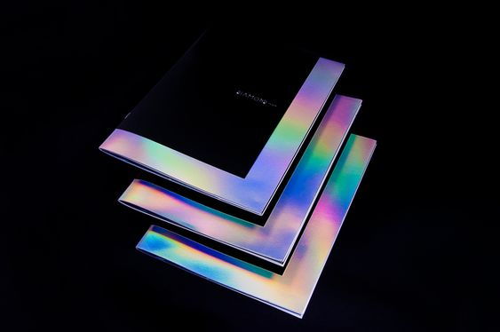

> Dragana, hvala ti što si doprinela energiji ovogodišnjeg Heapcon-a! Dizajn je definitivno nešto što unosi posebnost celoj konferenicji a i iskustvu njenih posetilaca. Da li možeš da nam kažeš koja je ideja i filozofija iza ovogodišnjeg dizajna?

Hvala vama što verujete u moje vizuelne instinkte! Oduvek mi je bila želja da kreiram identitet neke kreativne konferencije tako da sam već na početku imala ideje sa kojima sam htela da eksperimentišem.  Kada sam razmišljala o Heapcon-u 2020, imala sam na umu da je to konferencija o tehnologiji i digitalnoj kreativnosti. I sama radim u tom domenu i ako bih dozvolila sebi da pojednostavim ideju toga rekla bih da je to težnja da se kreira nešto jednostavno, intuitivno, no opet kompleksno,organsko, heterogeno, sirovo, podležno izmeni i rastu...

Tako sam krenula od najjednostavnijeg i najveličanstvenijeg oblika-kruga…

Koji će u interakciji da gubi i iznova stvara svoj oblik.

Sam će sadržati svoje osobine/boje ali i reflektovati nijanse koje ga orkužuju, raščlanjaviti se na nove elemente.

Htela sam da bojama pokažem jačinu zajedništva suprotnosti.

Skroz hladne sa skroz toplim bojama, koje se mešaju i nikad ne postaju smo jedna boja.

To predstavlja konstantni proces, traženje, prepuštanje, work-in-progress…

Tekstura tog kruga, odnosno lopte, kao da prolazi kroz sva stanja, ponekad izgleda metalna, ponekad vodena, ponekad kao da je fini tekstil na povetarcu.

{ .center }

{ .center }

> Kada bi tvoja metalno vodena lopta bila osoba, kakav bi karakter imao ili imala? Koje osobine bi ti istakla?

Volim ovakva pitanja. To bi bila neka pomalo čudna a poviše hrabra osoba koja je toliko sigurna u svoju čudnost da deluje sasvim normalna. :) Osoba koja voli nesavršenost i nedovršenost sebe, non stop se gradi i pomera granice a time privlači i poziva na akciju.

{ .center }

> Gde si pronašla inspiraciju za sve što si ovom prilikom kreirala?

Obično krenem od prirode. Tu je pregršt neverovatnih boja, tekstura, oblika. I imam osećaj ako krenem od toga ne mogu da pogrešim.

Sada sam razmišljala o odrazu u vodi, u tome kako voda reaguje kada uskočimo u nju, kako se koncentrično šire krugovi, kako svaki oblik prolazi kroz neku distorziju i nastaje neka nova kompozicija. Jedan oblik preuzima boju drugog i obrnuto. Kako kroz to gubimo granice sebe i postajemo deo nečeg većeg od nas samih.

{ .center }

Ceo dizajn je uklopljen i u sadašnje trendove. Upečatljive boje, [jaka monospace geometrijska tipografija](https://pangrampangram.com/products/neue-machina?variant=14717505765418) i  jednostavna ilustracija.

> Kako izgledaju različite primene dizajna?

Mislim da je dizajn  Heapcon-a 2020 prilično zahvalan kako za web, tako za štampu, prostornu instalaciju i slično. Glavni “karakter” cele priče je Blob Bob (kako smo mu dali radni naziv :D ) koji će proći kroz blage transformacije i tako diferencirati sadržaj. 

> Kakav utisak, kao tvorac ovog dizajna, želiš da preneseš ovogodišnjim učesnicima?

Pre svega da osete da su deo neke vredne i pažljivo osmišljene  priče. Volela bih da učesnici zapamte konferenciju po celokupnom doživljaju. Da animacija i zvuk koji se emituje pre svakog govora stvore autentičnu atmosferu.

Dizajn sam uvek gledala kao neku vrstu vizije. A ideja da primimo informaciju o budućnosti u obliku vizije pre nego što imamo bilo kakvu drugu informaciju mi deluje usko povezana sa tehnologijom i inovacijom.

> Sneak peek šta nas dalje očekuje? :D 

Ko zna :D  Oblici će svakako biti oživljeni kroz animaciju.

Volela bih da vizuale obogatim sa prikladnim zvukom koji bi dodatno kreairao atmosferu.

Jedva čekam da dođemo do štampe, igraću se sa folijama koje reflektuju razne boje.

Takođe biće zanimljiv izazov glavne elemente dizajna preneti u prostor. :)

{ .center }

{ .center }

Hvala ti, Dragana! Jedva čekamo dalje primene ove tvoje zanimljive ideje :)
