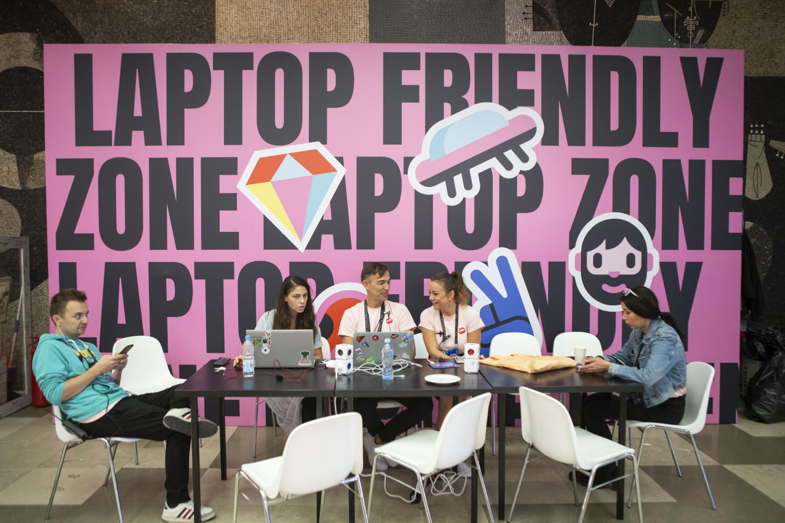
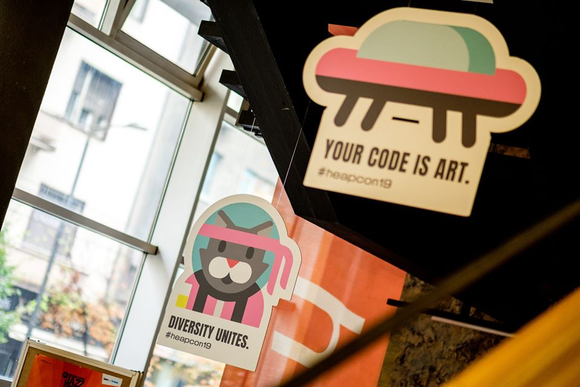
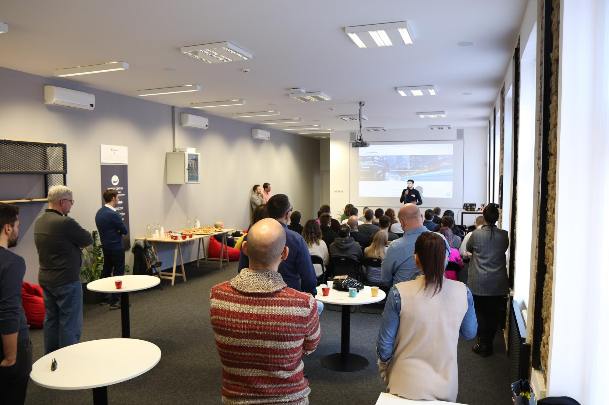
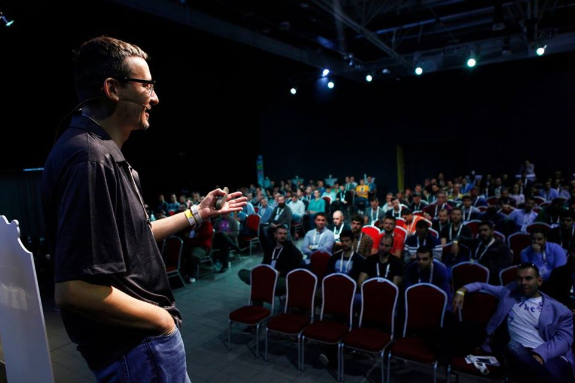

Kao i bilo koja druga zajednica, lokalne tech zajednice donose razlicite mogucnosti za učenje, razvoj, i čak upoznavanje novih ljudi. Iako mnogi ne shvataju čemu služe ove zajednice i zašto se priključiti lokalnoj tech zajednici, one ipak imaju svoju ulogu u oblikovanju društva i svesti pojedinaca.

## Šta Čini Zajednicu?

Zajednica je skup ljudi koji dele slična interesovanja. Ali to nije ono što čini jednu zajednicu. Zajednica se sastoji od događaja, radionica, i konferencija koje se organizuju. Ali tu učestvuju i ljudi:

+ Ljudi koji organizuju te događaje
+ Ljudi koji govore na događajima
+ Sponzori
+ Ljudi koji posećuju događaje

## Prilika za Učenje

Priključivanje tech zajednici pruža priliku za učenjem. Kao član zajednice, imate priliku da učite nešto novo. Odlaskom na događaje i konferencije dobijate priliku da slušate savete o različitim tehnologijama ili bilo čemu što vas zanima, ali takođe imate priliku da popričate sa iskusnijim ljudima od vas o čemu god želite. 

## Upoznavanje Novih Ljudi

Zajednice su najbolje mesto za upoznavanje ljudi sličnih interesovanja i razmišljanja. Moći ćete da upoznate nove ljude, nađete ljude sa zajedničkim interesovanjima ili one koji se bave istim stvarima. 

## Biti u Toku sa Dešavanjima

Tech zajednice i njihova događanja su odlično mesto da budete u toku sa najnovijim vestima i  dešavanjima oko vas. Tech zajednice ti daju uvid u ono što se dešava u tech industriji ali i u samoj zajednici. Može se desiti i da budete u toku sa dešavanjima i saznate nešto novo o mestima u kojima van svog grada ili čak u gradovima i državama u kojima još niste bili. Interakcijom u tech zajednici, imaćete uvid u sva dešavanja i novosti koje vas mogu interesovati.

## Deljenje Mišljenja i Rešavanje Problema

Imaćete priliku da izađete iz svoje zone komfora i nađete se u grupi ljudi gde ćete moći da delite svoje mišljenje i čujete šta drugi misle o određenoj temi koja i vas interesuje. Koji je bolji način da oblikujete vašu industriju i okolinu nego razmenom mišljenja sa ljudima istih ili sličnih interesovanja? Promene u svim industrijama su neizbežne, ali zahvaljujući ljudima u zajednici, možete lako podeliti vaša mišljenja, zapažanja i probleme koje imate. 

## Pomaganje Drugima

Samom razmenom mišljenja ćeš moći da pomogneš u rešavanju nekog problema - bilo svog ili tuđeg. Ali pored toga, moćeš i da postaviš neki problem, da se raspitaš kod svoje zajednice oko rešavanja nekog problema. Bilo da si zapeo na nekoj liniji koda ili želiš da rešiš neki problem u društvu, možeš očekivati podršku svoje lokalne zajednice u tome. 

# Promocija i Stvaranje Imena

Događaji u kojima učestvujete su takođe prilika da stvorite svoje ime i da promovišete vas i ono čime se bavite. Iako ovo nije primarni benefit niti razlog zašto ljudi ostaju članovi zajednica, svakako je vrlo koristna stvar biti u mogučnosti da izgradite sebe i svoje ime ljudima koji vam mogu pomoći u tome. 

## Zabavi Se

Tech zajednice nisu uštogljene, te slobodno možeš očekivati da se zabaviš svakom prilikom. Svaki događaj i konferencija se prave sa ciljem da posetiocima učini to iskustvo poučnim, ali i zabavnim i pamtljivim. Učestvovanjem u događajima organizovanim od strane tvoje lokalne tech zajednice, možeš očekivati jedinstveno iskustvo.

