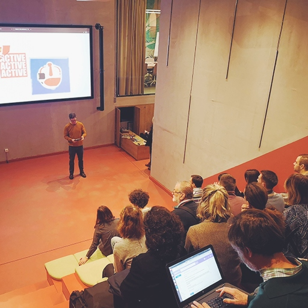

Pokrenut u decembru 2015. godine, Tehnološko doručak ima za cilj brzu razmenu preduzetničkih ideja u prijatnoj atmosferi prve jutarnje kafe. Četiri-pet predavanja od 5 minuta, 2 minuta za pitanja uz networking upotpunjen ukusom [Domaćih kiflica](http://domacekiflice.rs/) je sjajan način da se započne dan.

Od septembra 2018. godine, širimo inicijativu na Zagreb i Novi Sad, a u 2019. godini Doručak se održavao u Nišu, Osijeku i Subotici.

[Tehnološki doručak](https://tehnoloskidorucak.io/) je mesto za razmenu ideja i kao i svaki Heapspace projekat, otvoren je za prijave. Nije važno da li si programer, dizajner, preduzetnik ili marketar, prijavi svoju ideju i budi inspiracija drugima!

Ako imaš ideju koju želiš da podeliš na doručku, piši nam na: [dorucak@heapspace.rs](mailto:dorucak@heapspace.rs).

