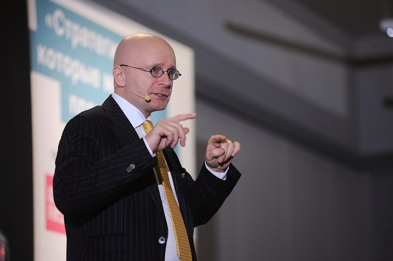

Organizacioni tim [Spark.me](http://spark.me/), jedne od najvećih marketinških konferencija u Jugoistočnoj Evropi, koja je zakazana za 30. i 31. maj u Auditorijumu [Porto Montenegra](https://portomontenegro.com/) u Tivtu, je objavio ime prvog glavnog govornika konferencije Spark.me 2020. U pitanju je Jonas Riderstrale (Jonas Ridderstråle), jedan od najuticajnijih i najpoštovanijih poslovnih mislilaca na svijetu i koautor bestselera “Funky Business“.

Dr Riderstrale je stekao svjetsku slavu knjigom “Funky Business” koja je brzo doživjela međunarodni uspjeh i koja je prodata u 300 hiljada primjeraka. Knjiga se, u anketi izdavačke kuće Bloomsbury, našla na 16. mjestu liste najpopularnijih poslovnih knjiga svih vremena. Nastavci, “Karaoke kapitalizam“ i “Funky Business zauvijek”, su takođe postali globalno priznati manifesti o tome kako ostvariti uspjeh u novom poslovnom svijetu. Sve tri knjige su napisane u koautorstvu sa Kjelom Nordstromom, a prevedene su na više od 30 jezika i objavljene su u preko 50 država.

Dr Riderstrale je svjetski poznati švedski akademik, sa doktoratom u oblasti međunarodnog biznisa i gostujući je profesor na Ashridge poslovnoj školi u Velikoj Britaniji. Istraživačka kompanija Global Gurus ga je izabrala kao jednog od Top 30 menadžment profesionalaca na svijetu i rangirala ga među Top 5 u Evropi. Njegova originalna, provokativna, inspirativna i dinamična predavanja su ga učinila govornikom koji je predavao na događajima od Moskve do Mumbaija i od San Franciska do Šangaja. Angažovan je kao konsultant za mnoge multinacionalne kompanije, državne institucije, sportske klubove i sindikate. Riderstraleove ideje privlače ogromnu pažnju medija širom svijeta, pa se njegov rad može naći i u globalnim publikacijama kao što su Fortune, Fast Company, Time magazine, Financial Times, The Times, Stern, Newsweek, Paris Match i mnoge druge.

Karte za konferenciju Spark.me 2020 se mogu kupiti na zvaničnom sajtu konferencije - www.spark.me. Puna cijena karte iznosi 300€, ali zainteresovani trenutno mogu kupiti svoju kartu po specijalnoj cijeni od 100€, jer je u prodaju pušteno 50 promotivnih karata. Kao motivacija za sve mlade ljude željne znanja, u ponudi su i studentske karte po cijeni od svega 50€, koje su namijenjene srednjoškolcima i studentima redovnih, postdiplomskih i doktorskih studija koji su mlađi od 27 godina. Cijena karte uključuje pristup svim predavanjima (30-31. maja), startap takmičenju (30-31. maja), ručak na bazi švedskog stola za oba dana konferencije, osvježenje na svim kafe pauzama u toku oba dana konferencije, kao i koktel prijem (30. maja). Cijena karte ne uključuje troškove prevoza i smještaja. Kupljene karte se mogu naknadno prenijeti na drugu osobu (“name change”), ali se uplaćeni novac ne može refundirati.

Spark.me, jedna od najvećih marketinških konferencija u Jugoistočnoj Evropi, koja je zakazana za 30. i 31. maj, se organizuje u Auditorijumu Porto Montenegra u Tivtu, jednom od najvećih auditorijuma u Crnoj Gori. Ovo je drugi put da će se Spark.me održati u Porto Montenegru, srcu nautičkog turizma Crne Gore i jednoj od najekskluzivnijih marina na Jadranskom primorju. Organizator Spark.me je kompanija doMEn d.o.o, agent registracije crnogorskog nacionalnog internet domena - .ME, koja od 2013. godine organizuje konferenciju jednom godišnje. Spark.me nudi priliku učesnicima da o aktuelnim trendovima u oblasti marketinga, tehnologije i biznisa uče od svjetski poznatih eksperata, te da ostvare kontakt sa liderima iz poslovnog svijeta, svijeta tehnologije i inovacija, marketarima, startapovima i ljudima željnih znanja. U 2019. godini, konferenciji Spark.me je prisustvovalo preko 720 učesnika iz 21 države širom svijeta.

Za više informacija o Spark.me 2020 posjetite zvanični sajt konferencije na adresi www.spark.me, Facebook stranicu [www.facebook.com/sparkdotme](http://www.facebook.com/sparkdotme), Twitter nalog [www.twitter.com/sparkdotme](http://www.twitter.com/sparkdotme) i Instagram nalog [www.instagram.com/sparkdotme/](http://www.instagram.com/sparkdotme/).
